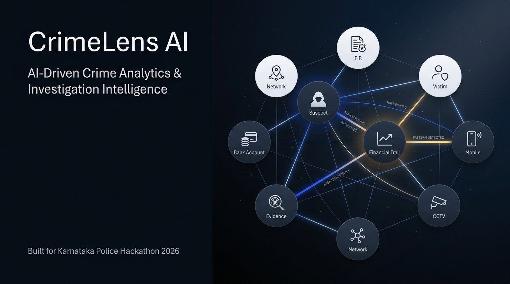
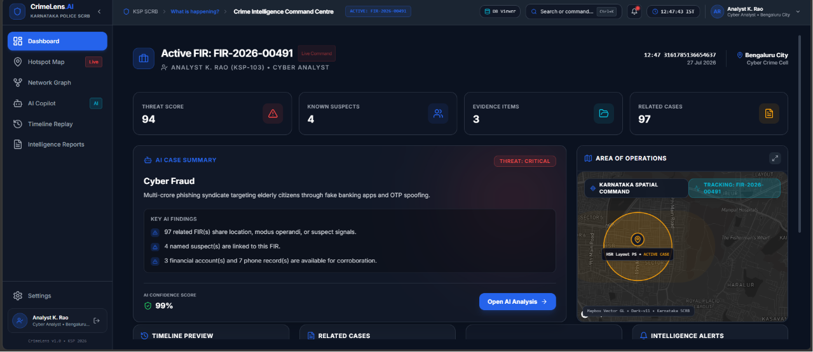
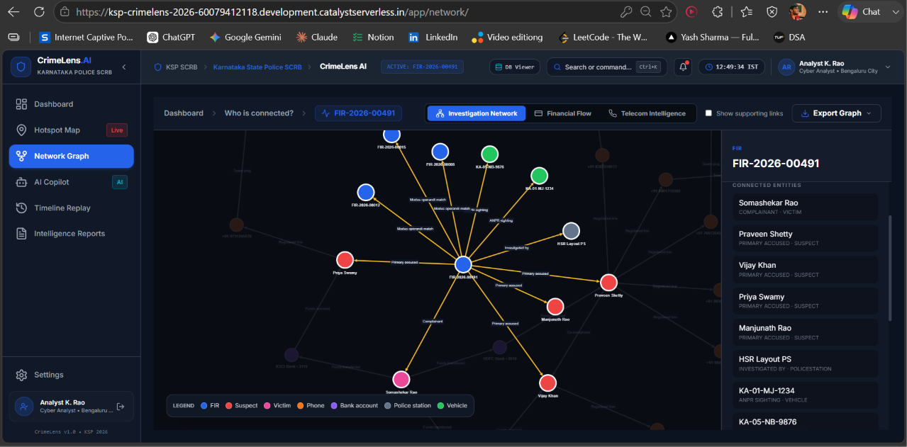
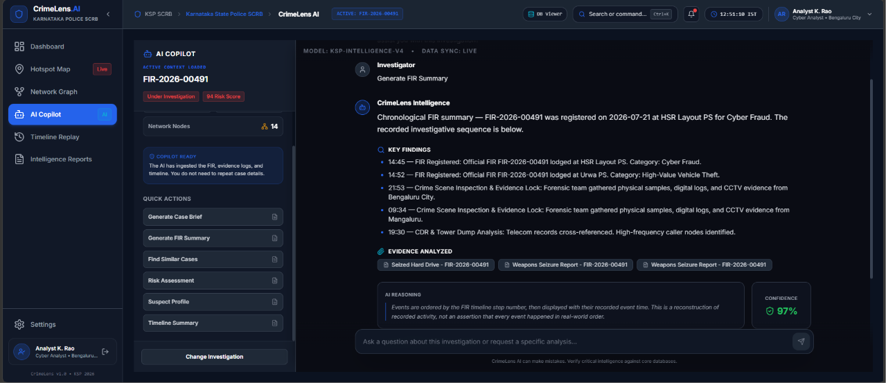
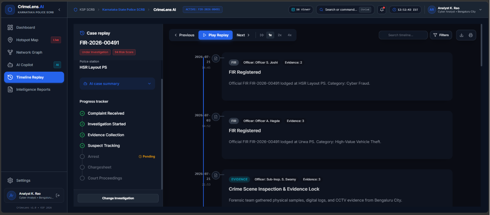
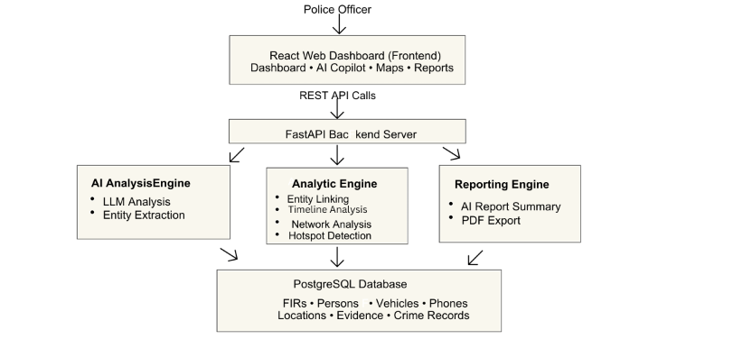

<!-- Hero Banner Placeholder -->
<div align="center">
  

  <h1>🚨 CrimeLens AI</h1>
  <p><b>AI-Driven Crime Analytics & Intelligence Platform</b></p>
  <p><i>Built for the Karnataka State Police (KSP) Hackathon 2026</i></p>

<!-- Technology Badges -->
<p>
  
  
  
  
  
</p>

<!-- Demo GIF Placeholder -->

</div>

<br />

> 🎥 **Watch the Full Demo on YouTube:** [CrimeLens AI Showcase](https://www.youtube.com/watch?v=lTZSI8-1KpM)
>
> 🚀 **Live Deployment:** [Test the Platform Here](https://ksp-crimelens-2026-60079412118.development.catalystserverless.in/app/login/)

---

## 📖 Prototype Brief

**CrimeLens AI** is an enterprise-grade, intelligence-driven investigation platform designed exclusively for law enforcement agencies. Built during the KSP Hackathon 2026, it unifies fragmented crime data, visualizes complex criminal networks, maps spatial hotspots, and leverages AI to accelerate the investigative workflow. 

---

## 🛑 The Problem Statement

Modern policing faces a massive data overload. Investigators often have to jump between isolated databases, static spreadsheets, and physical files to piece together a case. 
- **Fragmented Data:** Hard to connect suspects across different FIRs and jurisdictions.
- **Hidden Networks:** Syndicates and organized crime rings hide in the noise.
- **Time-Intensive:** Parsing through timelines, witness statements, and evidence takes hundreds of man-hours.
- **Reactive vs. Proactive:** Traditional tools tell you what happened, not what might happen next.

---

## 💡 Our Solution

CrimeLens AI transforms reactive data retrieval into **proactive intelligence**. By loading an FIR context into a unified workspace, officers get instant access to automated insights, spatial mapping, relationship graphs, and a conversational AI copilot that acts as a digital detective.

---

## ⚡ Why CrimeLens?

How do we differ from traditional investigation software? 

| Feature | Traditional Systems 📉 | CrimeLens AI 🚀 |
|---------|-----------------------|-----------------|
| **Data Analysis** | Manual reading and correlation. | AI-driven summarization and entity extraction. |
| **Relationships** | Static tables and lists. | Interactive Force-Directed Network Graphs. |
| **Geospatial** | Static pins on a map. | Live clustering and dynamic hotspot density mapping. |
| **Insights** | Requires query expertise. | Natural language AI Copilot chat interface. |
| **Reporting** | Manual document formatting. | One-click intelligence brief generation. |

---

## ✨ Key Highlights / Features

<details>
<summary><b>1. Interactive Investigation Workspace & Dashboard</b></summary>
Secure, role-based access that provides a centralized view of case metrics, critical alerts, suspect profiles, and dynamically generated recommendations.
</details>

<details>
<summary><b>2. Spatial Hotspot Mapping</b></summary>
An interactive GIS visualization interface to identify crime clusters and geographic patterns, helping deploy patrol units effectively.
</details>

<details>
<summary><b>3. Criminal Network Discovery (Force Graph)</b></summary>
Visually maps out relationships between suspects, victims, locations, and organizations to expose hidden syndicates.
</details>

<details>
<summary><b>4. Explainable AI Copilot</b></summary>
A context-aware chat assistant that reads FIR details and answers natural language questions, automatically formatting structured responses.
</details>

<details>
<summary><b>5. Timeline Replay & Chronological Analysis</b></summary>
An interactive timeline that scrubs through events to help investigators visualize the exact sequence of a crime.
</details>

<details>
<summary><b>6. Automated Intelligence Reports</b></summary>
Compiles summaries, networks, and spatial data into standardized, exportable intelligence briefs ready for senior command.
</details>

---

## 🖼️ Platform Screenshots Gallery

<div align="center">
  
| Operational Dashboard | Criminal Network Graph |
|:---:|:---:|
|  |  |
| *Real-time metrics and AI recommendations* | *Visualizing hidden syndicates and connections* |

| AI Copilot & Map | Timeline Replay |
|:---:|:---:|
|  |  |
| *Context-aware natural language assistance* | *Scrubbing through chronological case events* |

</div>

---

## 🎯 Golden Demo Workflow

Want to test the platform yourself? Follow this standard investigation flow:
1. **Login:** Access the system as a verified officer.
2. **Select FIR:** Choose an active case (e.g., *FIR-2026-00491: Cyber Fraud*).
3. **Review Dashboard:** Check the automated risk score and recommended next steps.
4. **Explore the Network:** Jump into the Network Graph to find common associates linked to the primary suspect.
5. **Ask the Copilot:** Ask the AI, *"Summarize the suspect's background"* or *"What are the missing links?"*.
6. **Generate Report:** Export the aggregated findings to an Intelligence Brief.

---

## 📊 Benchmarks & Impact

- ⏱️ **Investigation Speed:** Reduces case context compilation from hours to seconds.
- 🧠 **Centralized Intelligence:** Merges spatial, temporal, and relational data into one pane of glass.
- 🤖 **AI Assistance:** Eliminates manual reading of massive FIR documents via semantic summarization.
- 📈 **Visualization:** Instantly translates raw databases into actionable visual nodes and geographic hotspots.
- 📑 **Reporting:** Streamlines administrative overhead with one-click report generation.

---

## 🛠️ Technology Stack

- **Frontend Core:** Next.js 14 (App Router, Static Export), React, TypeScript
- **Styling & UI:** Tailwind CSS, Framer Motion, Lucide Icons, Shadcn UI
- **Geospatial Mapping:** React Leaflet, Leaflet.js
- **Data Visualization:** Recharts, React Force Graph
- **Backend Infrastructure:** Zoho Catalyst AppSail (Node.js/Express)
- **Deployment:** Zoho Catalyst Serverless Web Hosting

---

## 🏗️ Project Architecture

<div align="center">
  
  <p><i>High-level flow from the React Client to the Zoho Catalyst AppSail Backend.</i></p>
</div>

---

## 🚀 Getting Started

To run this project locally for development or testing:

### 1. Clone the repository
```bash
git clone https://github.com/Abhishekanand19/Karnataka-Police-Hackathon-2026.git
cd Karnataka-Police-Hackathon-2026
```

### 2. Install Dependencies
```bash
npm install
```

### 3. Run the Development Server
```bash
npm run dev
```

Open [http://localhost:3000](http://localhost:3000) with your browser to see the application.

---

## 📁 Repository Structure

```text
├── src/
│   ├── app/                # Next.js App Router pages
│   ├── components/         # Reusable React components (Dashboard, Map, AI, etc.)
│   ├── lib/                # Utilities and synthetic database schemas
│   └── providers/          # React Context providers (Investigation State)
├── backend/                # Node.js backend for Zoho Catalyst AppSail
├── public/                 # Static assets
└── next.config.mjs         # Next.js configuration
```

---

## 🔮 Future Scope

- **Integration with Real Data:** Connect the prototype's mocked endpoints to live Karnataka Police SCRB databases.
- **Advanced Real-Time NLP:** Implement Zoho Catalyst SmartAI for advanced anomaly detection and entity extraction.
- **Geospatial Expansion:** Integrate live dispatch data for real-time patrol deployment suggestions.
- **Catalyst Relational Data Store:** Migrate local mock data to robust CloudSQL databases.

---

## 🌍 Real-World Applications

While built for the KSP Hackathon, **CrimeLens AI** is designed to scale across any modern law enforcement agency, intelligence bureau, or financial fraud investigation unit requiring rapid correlation of disconnected datasets.

---

## 👨‍💻 Team Zero Plus

Built with ❤️ by **Team Zero Plus**:
- **Abhishek Anand**
- **Ashlesh P**

---

## 🙌 Acknowledgements

Special thanks to the **Karnataka State Police** and the organizers of the **KSP Hackathon 2026** for providing the opportunity and problem statements to innovate in the public safety space.

---

## 📜 License

This project is licensed under the MIT License - see the [LICENSE](LICENSE) file for details.

---

<div align="center">
  <b>If you like this project, please consider giving it a ⭐!</b>
</div>
