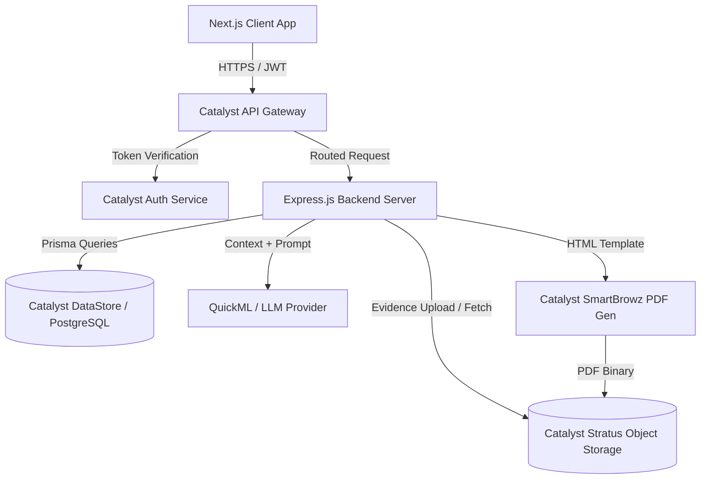
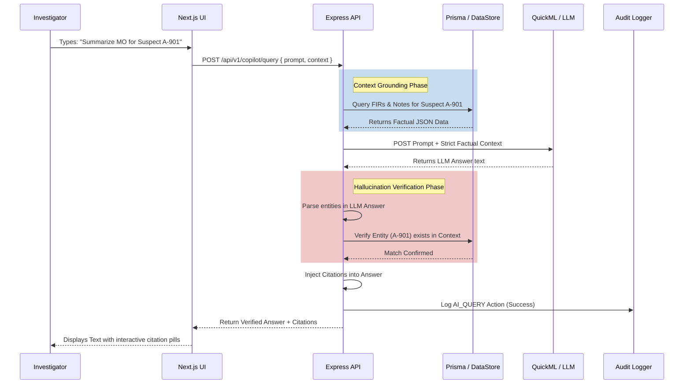
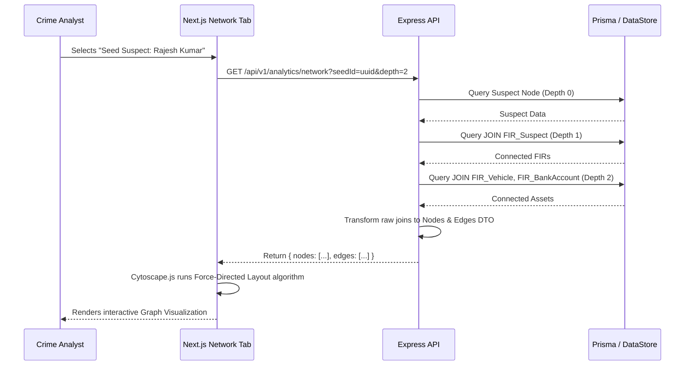

# CrimeLens AI – Data Flow & Sequence Diagrams

This document illustrates the end-to-end data flow and interaction between the Frontend, API Gateway, Backend Services, AI Engine, and the Database.

## 1. High-Level Data Flow

## 2. Sequence Diagram: AI Copilot Query (Zero Hallucination Flow)

This sequence illustrates how a user query is securely intercepted, grounded in factual database context, and verified before being presented to the user.

## 3. Sequence Diagram: Network Link Analysis

This sequence illustrates how the Cytoscape.js network graph is populated with multi-hop relational data.

