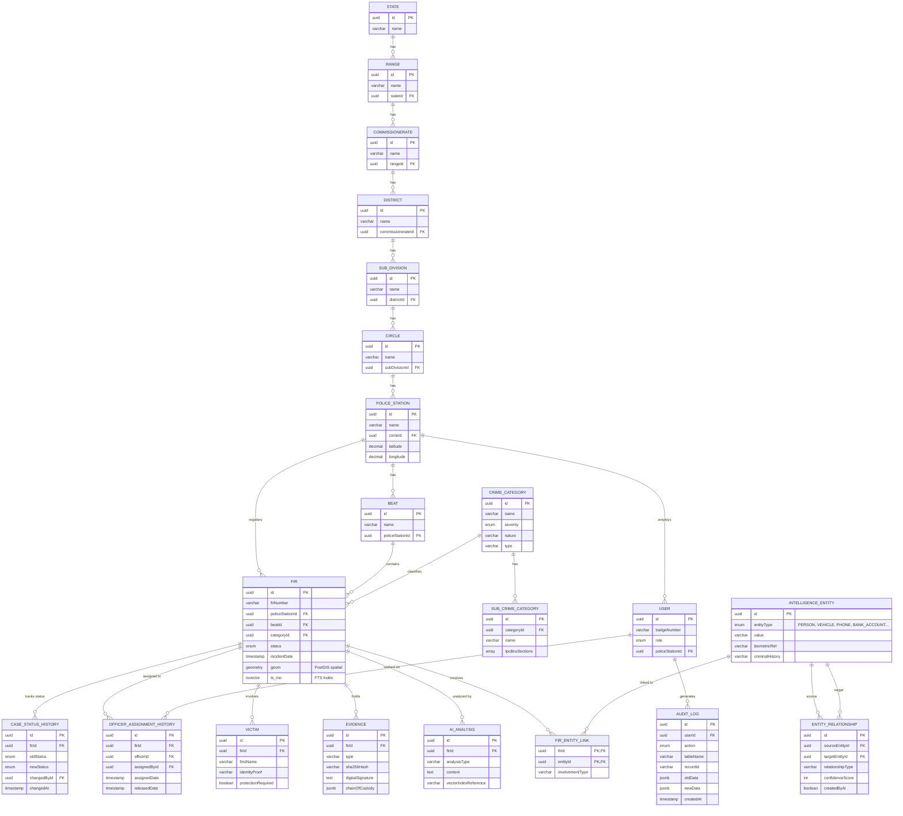

# Enterprise ERD: CrimeLens AI

The following Mermaid diagram visually maps the new enterprise schema architecture, depicting the strict 7-level police hierarchy, intelligence abstraction layers, and audit mappings.

